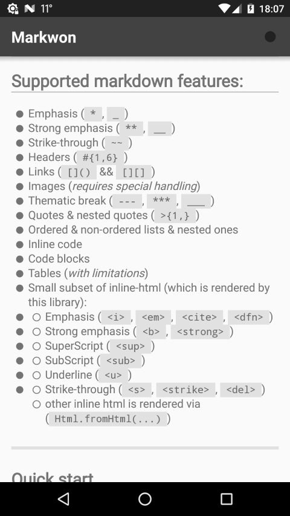
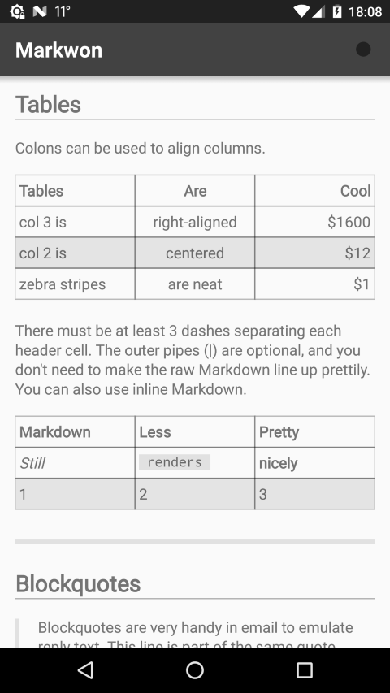
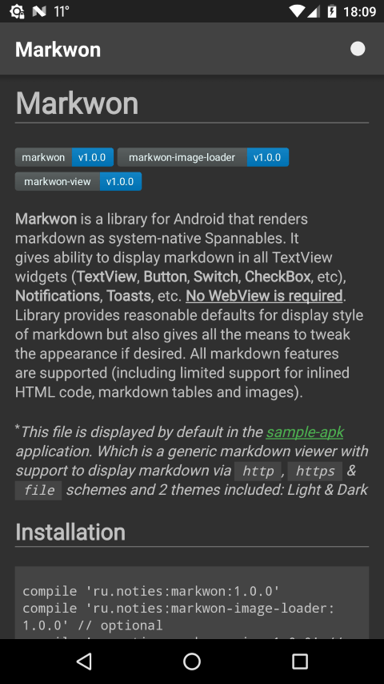

# Markwon

[](https://github.com/noties/Markwon/actions)

**Markwon** is a markdown library for Android. It parses markdown
following [commonmark-spec] with the help of amazing [commonmark-java]
library and renders result as _Android-native_ Spannables. **No HTML**
is involved as an intermediate step. <u>**No WebView** is required</u>.
It's extremely fast, feature-rich and extensible.

It gives ability to display markdown in all TextView widgets
(**TextView**, **Button**, **Switch**, **CheckBox**, etc), **Toasts**
and all other places that accept **Spanned content**. Library provides
reasonable defaults to display style of a markdown content but also 
gives all the means to tweak the appearance if desired. All markdown
features listed in [commonmark-spec] are supported
(including support for **inlined/block HTML code**, **markdown tables**,
**images** and **syntax highlight**).

`Markwon` comes with a [sample application](./app-sample/). It is a
collection of library usages that comes with search and source code for
each code sample.

Since version **4.2.0** **Markwon** comes with an [editor](./markwon-editor/) to _highlight_ markdown input
as user types (for example in **EditText**).

[commonmark-spec]: https://spec.commonmark.org/0.28/
[commonmark-java]: https://github.com/atlassian/commonmark-java/blob/master/README.md

## Installation


```kotlin
implementation "io.noties.markwon:core:${markwonVersion}"
```

Full list of available artifacts is present in the [install section](https://noties.github.io/Markwon/docs/v4/install.html)
of the [documentation] web-site.

Please visit [documentation] web-site for further reference.


> You can find previous version of Markwon in [2.x.x](https://github.com/noties/Markwon/tree/2.x.x)
and [3.x.x](https://github.com/noties/Markwon/tree/3.x.x) branches


## Supported markdown features:
* Emphasis (`*`, `_`)
* Strong emphasis (`**`, `__`)
* Strike-through (`~~`)
* Headers (`#{1,6}`)
* Links (`[]()` && `[][]`)
* Images
* Thematic break (`---`, `***`, `___`)
* Quotes & nested quotes (`>{1,}`)
* Ordered & non-ordered lists & nested ones
* Inline code
* Code blocks
* Tables (*with limitations*)
* Syntax highlight
* LaTeX formulas
* HTML
  * Emphasis (`<i>`, `<em>`, `<cite>`, `<dfn>`)
  * Strong emphasis (`<b>`, `<strong>`)
  * SuperScript (`<sup>`)
  * SubScript (`<sub>`)
  * Underline (`<u>`, `ins`)
  * Strike-through (`<s>`, `<strike>`, `<del>`)
  * Link (`a`)
  * Lists (`ul`, `ol`)
  * Images (`img` will require configured image loader)
  * Blockquote (`blockquote`)
  * Heading (`h1`, `h2`, `h3`, `h4`, `h5`, `h6`)
  * there is support to render any HTML tag
* Task lists:
- [ ] Not _done_
  - [X] **Done** with `X`
  - [x] ~~and~~ **or** small `x`
---

## Screenshots

Taken with default configuration (except for image loading) in [sample app](./app-sample/):

<a href="./art/mw_light_01.png"></a>
<a href="./art/mw_light_02.png"></a>
<a href="./art/mw_light_03.png"></a>
<a href="./art/mw_dark_01.png"></a>

By default configuration uses TextView textColor for styling, so changing textColor changes style

---

## Documentation

Please visit [documentation] web-site for reference

[documentation]: https://noties.github.io/Markwon


## Consulting
Paid consulting is available. Please reach me out at [markwon+consulting[at]noties.io](mailto:markwon+consulting@noties.io)
to discuss your idea or a project

---

# Demo
Based on [this cheatsheet][cheatsheet]

---

## Headers
---
# Header 1
## Header 2
### Header 3
#### Header 4
##### Header 5
###### Header 6
---

## Emphasis

Emphasis, aka italics, with *asterisks* or _underscores_.

Strong emphasis, aka bold, with **asterisks** or __underscores__.

Combined emphasis with **asterisks and _underscores_**.

Strikethrough uses two tildes. ~~Scratch this.~~

---

## Lists
1. First ordered list item
2. Another item
  * Unordered sub-list.
1. Actual numbers don't matter, just that it's a number
  1. Ordered sub-list
4. And another item.

   You can have properly indented paragraphs within list items. Notice the blank line above, and the leading spaces (at least one, but we'll use three here to also align the raw Markdown).

   To have a line break without a paragraph, you will need to use two trailing spaces.
   Note that this line is separate, but within the same paragraph.
   (This is contrary to the typical GFM line break behaviour, where trailing spaces are not required.)

* Unordered list can use asterisks
- Or minuses
+ Or pluses

---

## Links

[I'm an inline-style link](https://www.google.com)

[I'm a reference-style link][Arbitrary case-insensitive reference text]

[I'm a relative reference to a repository file](../blob/master/LICENSE)

[You can use numbers for reference-style link definitions][1]

Or leave it empty and use the [link text itself].

---

## Code

Inline `code` has `back-ticks around` it.

```javascript
var s = "JavaScript syntax highlighting";
alert(s);
```

```python
s = "Python syntax highlighting"
print s
```

```java
/**
 * Helper method to obtain a Parser with registered strike-through &amp; table extensions
 * &amp; task lists (added in 1.0.1)
 *
 * @return a Parser instance that is supported by this library
 * @since 1.0.0
 */
@NonNull
public static Parser createParser() {
  return new Parser.Builder()
      .extensions(Arrays.asList(
          StrikethroughExtension.create(),
          TablesExtension.create(),
          TaskListExtension.create()
      ))
      .build();
}
```

```xml
<ScrollView
  android:id="@+id/scroll_view"
  android:layout_width="match_parent"
  android:layout_height="match_parent"
  android:layout_marginTop="?android:attr/actionBarSize">

  <TextView
    android:id="@+id/text"
    android:layout_width="match_parent"
    android:layout_height="wrap_content"
    android:layout_margin="16dip"
    android:lineSpacingExtra="2dip"
    android:textSize="16sp"
    tools:text="yo\nman" />

</ScrollView>
```

```
No language indicated, so no syntax highlighting.
But let's throw in a <b>tag</b>.
```

---

## Tables

Colons can be used to align columns.

| Tables        | Are           | Cool  |
| ------------- |:-------------:| -----:|
| col 3 is      | right-aligned | $1600 |
| col 2 is      | centered      |   $12 |
| zebra stripes | are neat      |    $1 |

There must be at least 3 dashes separating each header cell.
The outer pipes (|) are optional, and you don't need to make the
raw Markdown line up prettily. You can also use inline Markdown.

Markdown | Less | Pretty
--- | --- | ---
*Still* | `renders` | **nicely**
1 | 2 | 3

---

## Blockquotes

> Blockquotes are very handy in email to emulate reply text.
> This line is part of the same quote.

Quote break.

> This is a very long line that will still be quoted properly when it wraps. Oh boy let's keep writing to make sure this is long enough to actually wrap for everyone. Oh, you can *put* **Markdown** into a blockquote.

Nested quotes
> Hello!
>> And to you!

---

## Inline HTML

```html
<u><i>H<sup>T<sub>M</sub></sup><b><s>L</s></b></i></u>
```

<u><i>H<sup>T<sub>M</sub></sup><b><s>L</s></b></i></u>

---

## Horizontal Rule

Three or more...

---

Hyphens (`-`)

***

Asterisks (`*`)

___

Underscores (`_`)


## License

```
  Copyright 2019 Dimitry Ivanov (legal@noties.io)

  Licensed under the Apache License, Version 2.0 (the "License");
  you may not use this file except in compliance with the License.
  You may obtain a copy of the License at

      http://www.apache.org/licenses/LICENSE-2.0

  Unless required by applicable law or agreed to in writing, software
  distributed under the License is distributed on an "AS IS" BASIS,
  WITHOUT WARRANTIES OR CONDITIONS OF ANY KIND, either express or implied.
  See the License for the specific language governing permissions and
  limitations under the License.
```

[cheatsheet]: https://github.com/adam-p/markdown-here/wiki/Markdown-Cheatsheet

[arbitrary case-insensitive reference text]: https://www.mozilla.org
[1]: http://slashdot.org
[link text itself]: http://www.reddit.com
