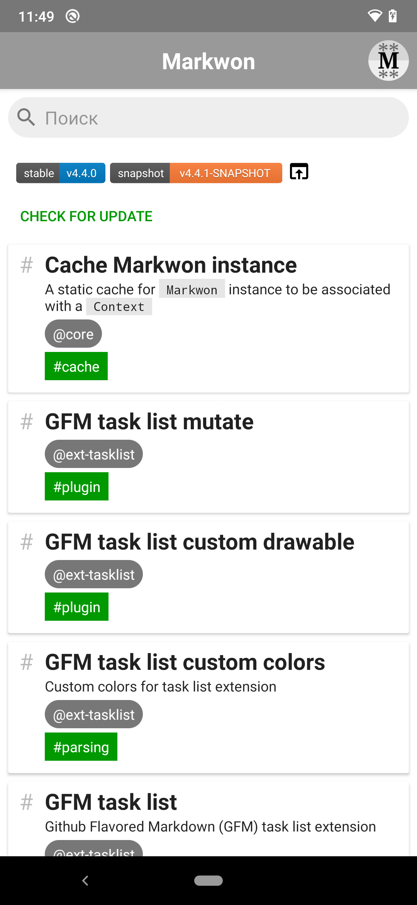
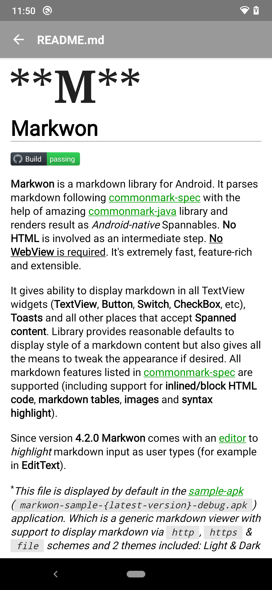
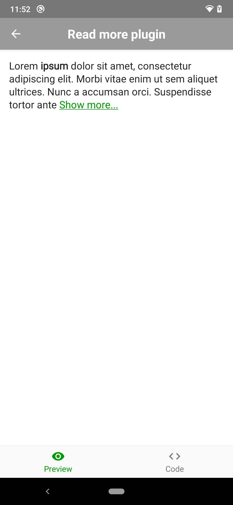
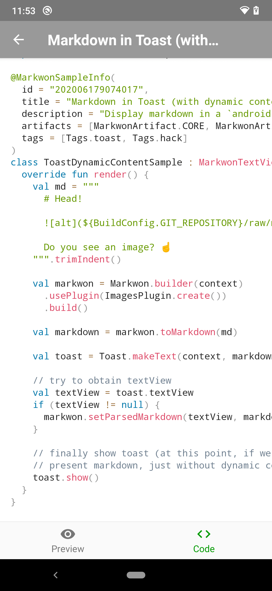

# Markwon sample app

Collection of sample snippets showing different aspects of `Markwon` library usage. Includes
source code of samples, latest stable/snapshot version of the library and search functionality.
Additionally can check for updates. Can be used to preview markdown documents from the `Github.com`.

<a href="../art/sample-screen-01.png"></a>
<a href="../art/sample-screen-02.png"></a>
<a href="../art/sample-screen-03.png"></a>
<a href="../art/sample-screen-04.png"></a>

## Distribution

Sample app is distributed via special parent-less branch [sample-store](https://github.com/noties/Markwon/tree/sample-store).
Inside the app, under version badges, tap `CHECK FOR UPDATES` to check for updates. Sample app
is not attached to main libraries versions and can be _released_ independently.

Application is signed with `keystore.jks`, which fingerprints are:
* __SHA1__: `BA:70:A5:D2:40:65:F1:FA:88:90:59:BA:FC:B7:31:81:E6:37:D9:41`
* __SHA256__: `82:C9:61:C5:DF:35:B1:CB:29:D5:48:83:FB:EB:9F:3E:7D:52:67:63:4F:D2:CE:0A:2D:70:17:85:FF:48:67:51`


[Download latest APK](https://github.com/noties/Markwon/raw/sample-store/markwon-debug.apk)


## Deeplink

Sample app handles special `markwon` scheme:
* `markwon://sample/{ID}` to open specific sample given the `{ID}`
* `markwon://search?q={TEXT TO SEARCH}&a={ARTIFACT}&t={TAG}`

Please note that search deeplink can have one of type: artifact or tag (if both are specified artifact will be used).

To test locally:

```
adb shell am start -a android.intent.action.ACTION_VIEW -d markwon://sample/ID
```

Please note that you might need to _url encode_ the `-d` argument

## Building

When adding/removing samples _most likely_ a clean build would be required.
First, for annotation processor to create `samples.json`. And secondly,
in order for Android Gradle plugin to bundle resources referenced via
symbolic links (the `sample.json` itself and `io.noties.markwon.app.samples.*` directory)

```
./gradlew :app-s:clean :app-s:asDe
```


## Tests

This app uses [Robolectric](https://robolectric.org)(v3.8) for tests which is incompatible
with JDK > 1.8. In order to run tests from command line with IDEA-bundled JDK - a special argument is
required:

```
./gradlew :app-s:testDe -Dorg.gradle.java.home="{INSERT BUNDLED JDK PATH HERE}"
```

To obtain bundled JDK:
* open `Project Structure...`
* open `SDK Location`
* copy contents of the field under `JDK Location`